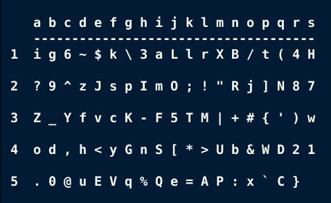
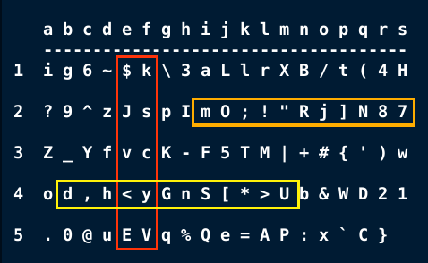

# Password Card

## Generate a unique and strong password the easy way. 
## Use the grid of the password card to select random letters, digits, and special characters.

Usage:

```
$ python3 generate_card.py 
```

Specify a file name (optional).
```
$ python3 generate_card.py --file my-passwd-card.txt
```




